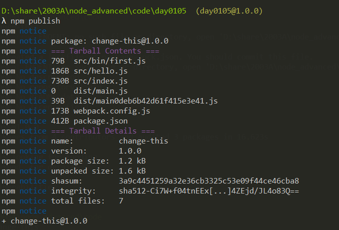

# day1011

npm 包 

npm install -S 生产环境 / -D 开发环境  -g  全局

npm包下载过程


全局安装路径

```js
 npm config get prefix
```

webpack 

npx webpack  打包 

node_modules

.bin  可执行程序的命令 webpack.cmd --> bin->cli.js

## 创建自己的可执行命令

1. package.json  script:{

   ​	"first":"/bin/xxx"

   }

2. ```js
   #! /usr/bin/env node
   xxx
   ```

3. npm link  发布到全局

   npx first

### 发布一个包到npm官网

1. 注册一个账号  https://npmjs.com

2. 改变代理  npm config get registry 

   npm config set registry https://registry.npmjs.org

3.  npm login  登录

   用户名 

   密码 不会提示

4. npm publish  注意 package.json 所在的目录 publish  

   包的名字 package.json 里面name字段决定的  npm install  包名 

   包名 规范 : 不能有空格  不能有大写  不能数字开头 如果有多个字母 通过- 连接  不能和已有的包名重复

    

5. 别人用  npm i change-this

   let res = require('change-this')

   main: 指定一个入口文件的字段

6. 更新这个包  

   1. 改版本  1.0.1 
   2. npm publish 

7. 卸载包  npm unpublish --force

## 给别人用

- require('change-this')

- 命令行的方式运行  babel / webpack  / eslint 

### 命令行

1. 创建命令行程序
2. process 参数 输入 输出 

## process 进程

1. 不需要引入就可以直接使用
2. 进程，一个程序运行开始到结束的相关信息都会记录在process中，一旦程序运行完毕后，进程就会退出
3. 提供了一些方法和参数
   1. exit() 强制退出进程
   2. abort() 强制退出进程 生成core文件
   3. arch  参数 过去cpu架构字符串
   4. argv 用来接收命令行传递的参数
   5. atgv() 返回当前环境的字符串
   6. cwd() 返回当前工作目录
   7. chdir() 改变当前的工作目录
   8. env 获取当前系统环境变量 也可以随意设置  // process.env.NODE_ENV === 'production'? '': '''
4. 常用的api
   1. proccess.stdin 表示的是一个输入流  代表从命令行中输入的内容  存在内存中
   2. process.stdout 表示的是一个输出流 输出到控制台

## 常见的模块以及模块的模拟

node中常见的模块

fs  path  url  http  https  child_process  crypto(https) 


## event

发布订阅 一放发送 订阅方去接收


### 练习 

1. 下载我的包 用一下
2. 自己发布一个包 hbj-utils

