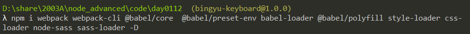

# day0112

回顾

npm 发包 

event 撰写

## 发包的完整流程- 发布一个高质量的包

1. 模板的基础代码
2. 注册一个npm 账号
3. 配置 package.json
4. 如果有命令 则编写命令文件 bin
5. 配置webpack 
6. 单元测试 程序界 检测代码质量的标准
7. 完善readme.md 别人该知道怎么用
8. 持续集成 github 自动部署
9. 发布

### 原则

1. 最好没有依赖 
2. 提供接口
   1. react-router-dom  : Route  Redirect ...  Component
   2. 可以是方法  可以是实例  也可以是类
   3. 参数{配置}
   4. ...

## 环境的搭建

1. package.json

2. readme.md

3. 依赖的下载(下载到开发环境)

   

4. 配置webpack

   自带的优化  方法 tree-sharking 砍树算法

