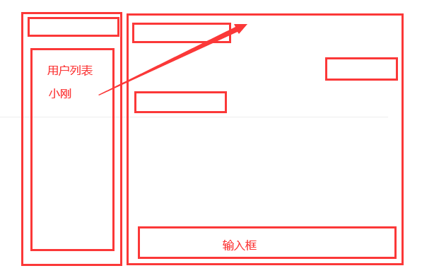
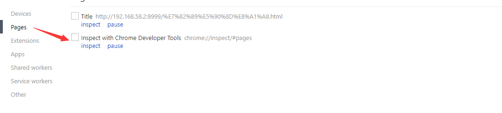
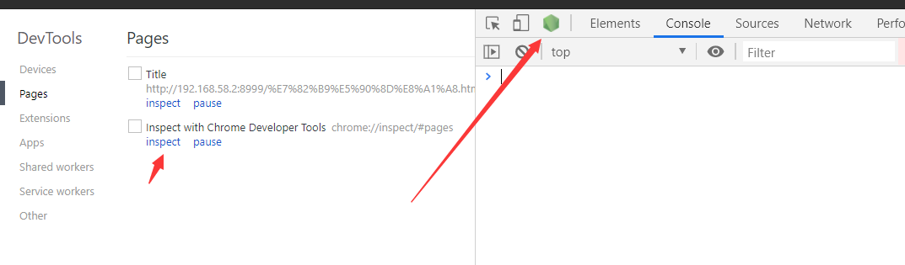
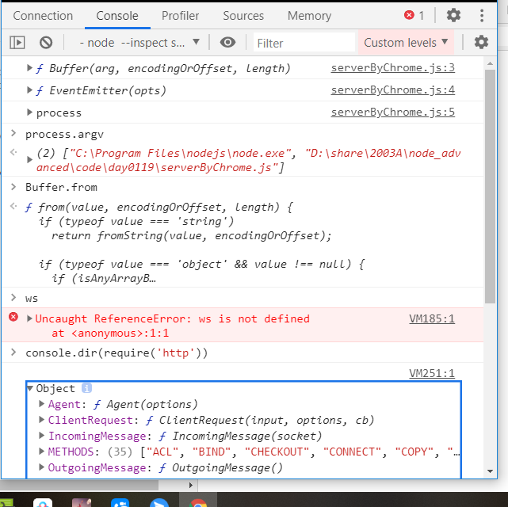

# day0119

回顾

anywhere ：ejs SEO  

socket：通信

- 前端

  let ws = new WebSocket（地址）

  ws.onopen = function(){}

  ws.onmessage = function(msg){}

  ws.send(JSON.stringify())

  ws.readyState 0 - 3 


## 群聊

1. 前端 不需要改变 
   1. 通过身份表示 和 code  码
   2. 不存在跨域
2. 后端 登录 注册 json文件

作业：

1. 注册或者登录

2. 聊天室

3. 所有的人展示出来（包括你 也包括其他的小伙伴）

4. 群聊

5. 单聊（私密聊天）

   

## 1. chrome浏览器调试node

1. node环境打印 输出结果 在哪看 小黑板里面看
2. 前端人员习惯了使用浏览器查看结果

### 1.1 保证自己的node程序进程不会中断 

### 1.2 在启动node的时候 --inspect

```bash
node --inspect serverByChrome.js 
```

### 1.3 chrome浏览器的地址中 chrome://inspect

点击pages里面的 带有chrome://inspect 选项的 inspect按钮





点击绿色按钮

 

## 2. koa入门

