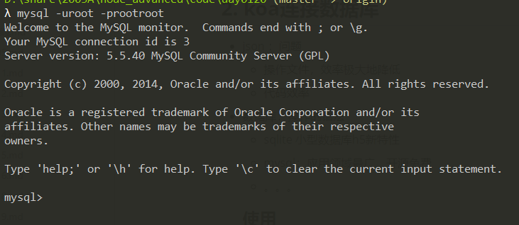
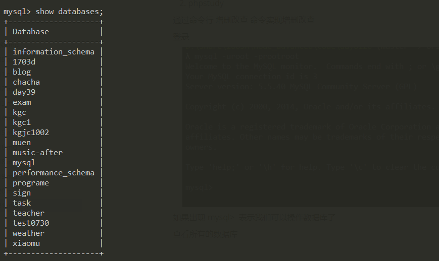
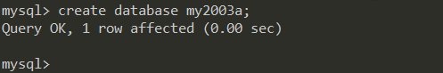
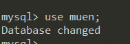
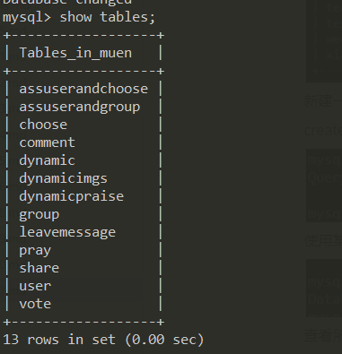

# koa

1. koa常用中间件都有哪些
2. 如何自己写一个中间件
3. koa核心api有哪些发生改变
4. koa如何编写接口
5. koa和express有何区别

## 1. koa的中间件

多级中间件级联效应：洋葱圈模型

加入了有多个中间件的话，name每个中间可以根据 await next()，分成两部分，上半部分按照添加的顺序依次执行，下半部分按照添加的逆序去执行，

 

  

 

时间处理的中间件 请求-响应 时间差的计算 就可以计算每个请求的时间

## 2. koa连接数据库

- json ：问题

  - 操作文件，效率极大地降低
  - 代码效率

- 数据库：操作的语法

  - sqlite 小型数据库h5新特性
  - mysql：应用领域最广，开源免费
  - 。。。
  
  ### 使用
  
  1. 下载安装
  2. phpstudy
  
  通过命令行 增删改查 命令实现增删改查
  
  登录
  
  
  
  如果出现 mysql>  表示我们可以操作数据库了
  
  查看所有的数据库
  
  
  
  新建一个数据库
  
  create database 数据库名字;
  
   
  
  使用某一个数据库
  
   
  
  查看所有的表
  
   
  
  
  
  数据库工具 Navicat Premium 。。。

## 3. koa鉴权