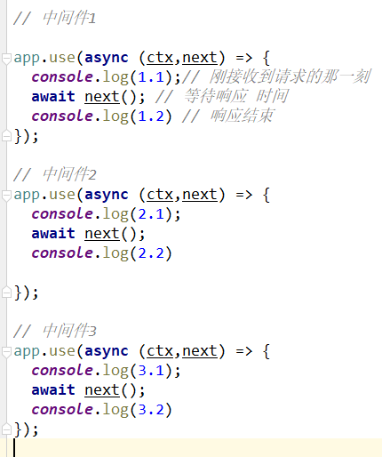
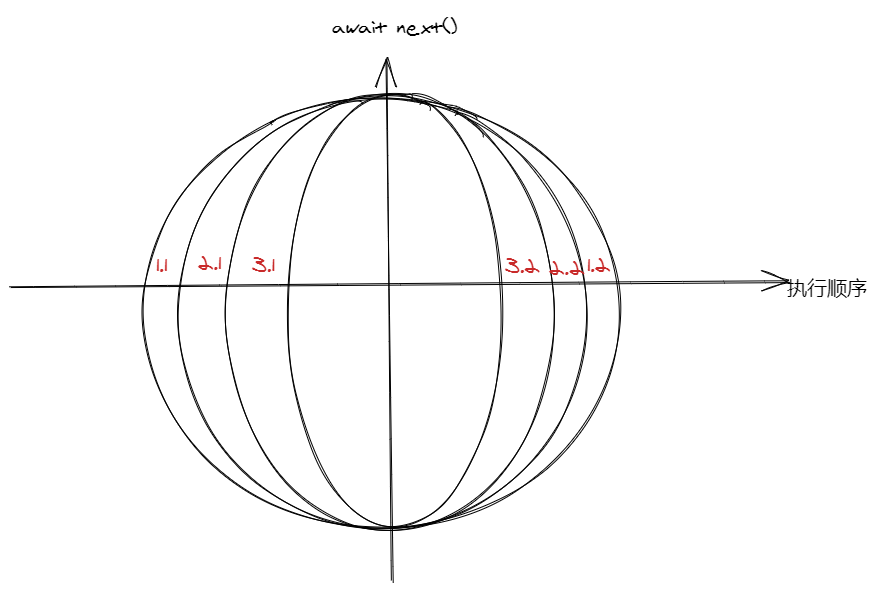
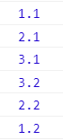
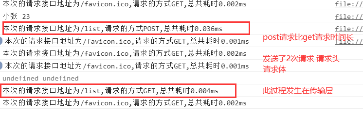

# koa

1. koa常用中间件都有哪些
2. 如何自己写一个中间件
3. koa核心api有哪些发生改变
4. koa如何编写接口
5. koa和express有何区别

## 1. koa的中间件

多级中间件级联效应：洋葱圈模型

加入了有多个中间件的话，name每个中间可以根据 await next()，分成两部分，上半部分按照添加的顺序依次执行，下半部分按照添加的逆序去执行，

 

  

 

时间处理的中间件 请求-响应 时间差的计算 就可以计算每个请求的时间

## 2. koa连接数据库

## 3. koa鉴权